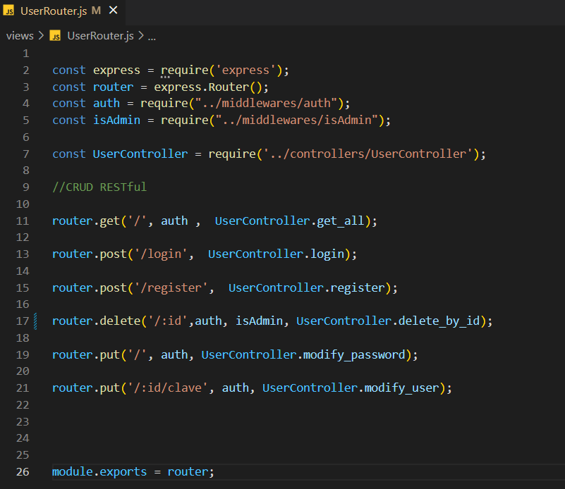
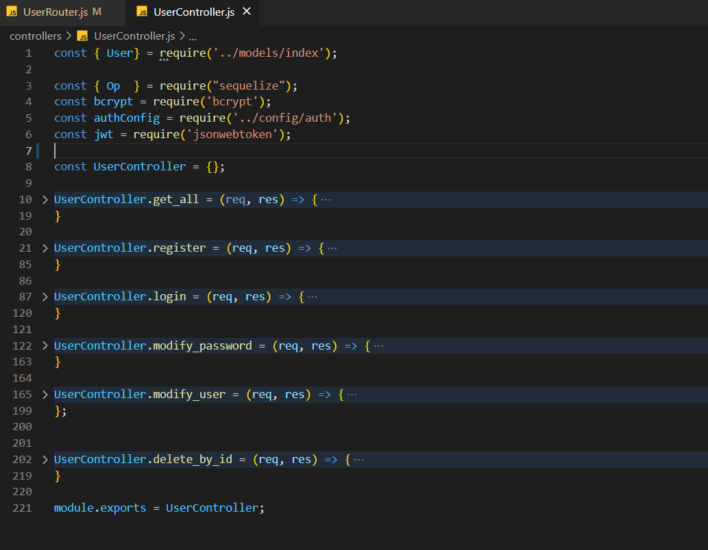
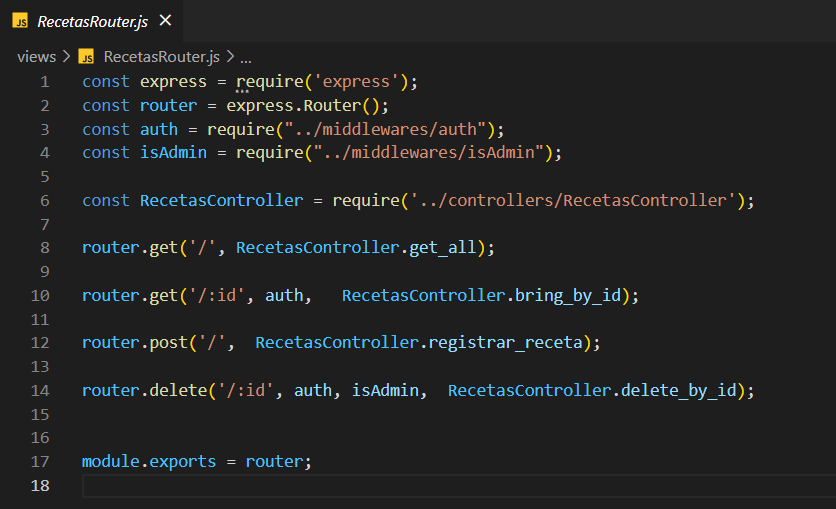
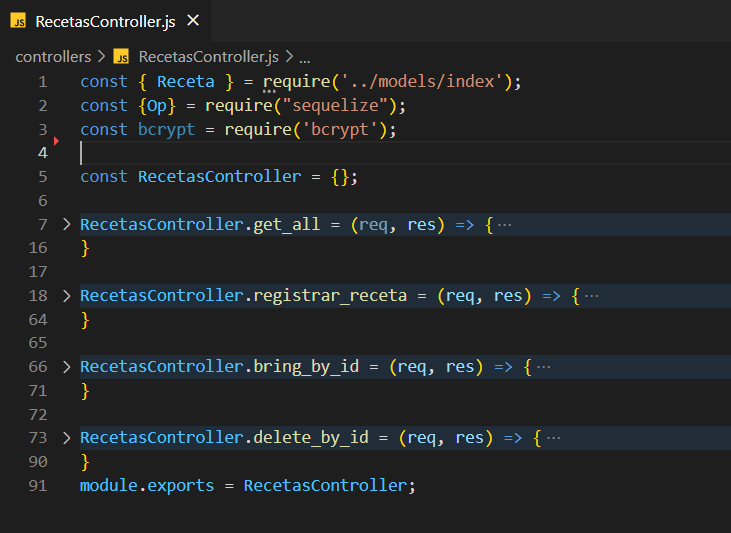
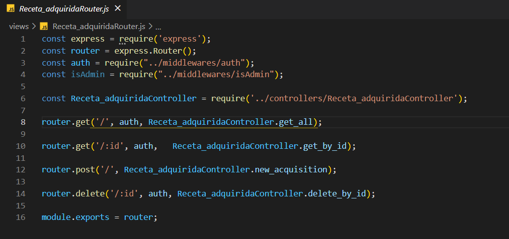
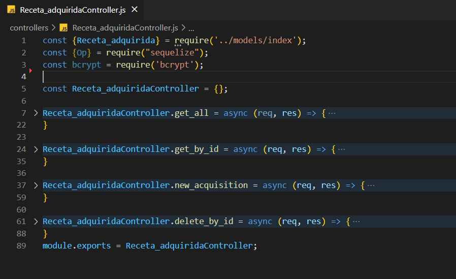
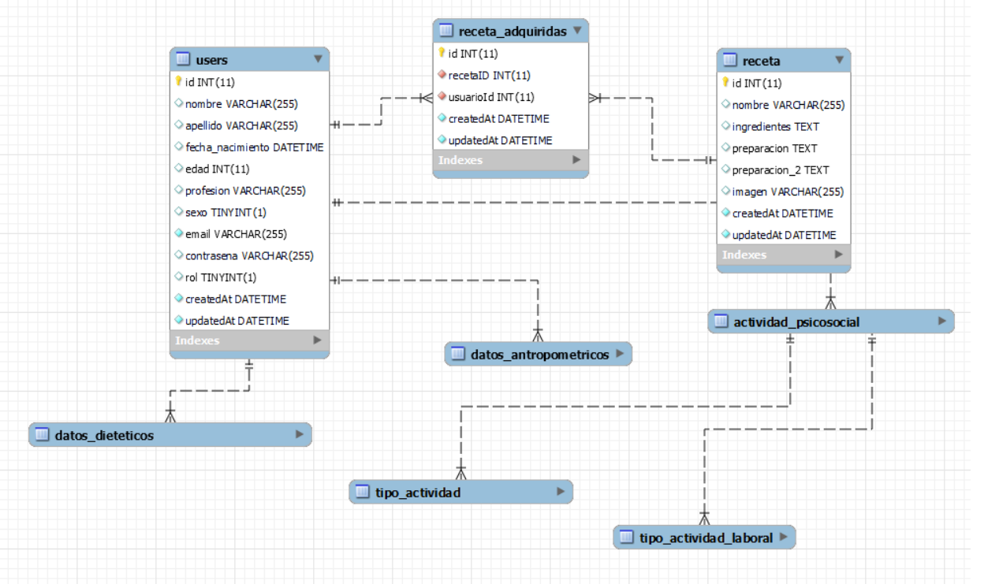

# healthyByC_Backend

Este proyecto consiste en recrear el backend de una pagina web de recetas de comidas saludables donde los usuarios podran registrarse, ver las recetas disponibles,
y adquirirlas. Para esto utilizamos el metodo MVC(modelo, vista y controlador), explicaremos cada uno de estos a continuacion. 
Para las BBDD utilizamos Sequelize( que es el ORM para Node que nos permite ejecutar sentencias SQL a travez de MySQL Workbench).

### Instrucciones 

<ol>
  <li>Comenzamos con clonar este repositorio en tu ordenador con el comando Git clone URL </li>
   <li>npm init -y para arrancar node</li>
    <li>npm i para descargar todas las dependecias que use en este proyecto como:  
      <ul>
         <li>sequelise</li>
         <li>mysql2</li>
         <li>axios</li>
         <li>express</li>
         <li>nodemon</li>
         <li>cors</li>
         <li>jsonwebtoken</li>
         <li>bcrypt</li>
      </ul>

      

      
      
      
      
  <li> sequelize init, para arrancar a hacer peticiones SQL</li>
  <li> npm run dev, para levantar el servidor.  Las peticiones que le haras al mismo se haran a travez de Postman simulando que tenemos un frontend(futurmente lo habra)</li>
  </ol>
  
   # Habiendo dicho que use el patron MVC mostrare el de cada tabla usado.
   
   ## Estos son los endpoints de USER y sus funciones van redirigidos a la carpeta controller y su fichero propio, en este caso UserController donde veras sus siguientes funciones.

## Estos son los endpoints de USER y sus funciones van redirigidos a la carpeta controller y su fichero propio, en este caso UserController donde veras sus siguientes funciones.

   ## Estos son los endpoints de RECETAS y sus funciones van redirigidos a la carpeta controller y su fichero propio, en este caso RecetasControllers donde veras sus siguientes funciones.

## Estos son los endpoints de RECETAS y sus funciones van redirigidos a la carpeta controller y su fichero propio, en este caso RecetasController donde veras sus siguientes funciones.

   ## Estos son los endpoints de RECETA_ADQUIRIDA y sus funciones van redirigidos a la carpeta controller y su fichero propio, en este caso Receta_adquiridaController donde veras sus siguientes funciones.

## Estos son los endpoints de RECETA_ADQUIRIDA y sus funciones van redirigidos a la carpeta controller y su fichero propio, en este caso Receta_adquiridaController donde veras sus siguientes funciones.

# Relacion de las tablas.
Una de las razones por las que use SQL para mi BBDD fue porque puedo hacer tablas relacionadas. Aqui dejo una foto de mis tablas.

# Futuras incorporaciones.

Pronto se podra permitir al usuario de ingresar sus datos para que la nutricionista le haga una dieta personalizada al mismo de acuerdo a sus especificaciones y objetivos dieteticos.
Por eso hay mas tablas de las mostradas en la imagen.

# Dev: Juan Pablo Parra Labarca.
# Email: parrajp1996@gmail.com.

